## 项目结构

-  [log](LoRA_jittor/NLG/log) 文件夹包含了**每次实验的日志记录和loss曲线图**
-  [src](LoRA_jittor/NLG/src) 文件夹包含了用于数据处理、训练以及解码的源代码。
-  [eval](LoRA_jittor/NLG/eval) 文件夹包含了针对特定任务的评估脚本代码。
-  [data](LoRA_jittor/NLG/data) 文件夹包含了实验所使用的小样本数据。
-  [data_entire](LoRA_jittor/NLG/data_entire) 文件夹包含了完整的原始数据。
-  [vocab](LoRA_jittor/NLG/vocab) 文件夹包含了 GPT-2 的词表文件。

## 环境配置

### 实验环境

ubuntu 22

RTX 3060 6G 

cuda 12.8

python 3.7.0

jittor 1.3.9.14

torch 1.7.1+cu110

conda 24.9.2

matplotlib 3.5.3

## 配置步骤

1. 安装anaconda（python环境管理，可根据需要下载）

   在Ubuntu系统里面使用firefox浏览器进入Anaconda官网：https://www.anaconda.com/，`Download`下载到本地（Anaconda会根据访问网页所使用的系统，推荐对应的Anaconda版本，用户无需担心版本错误）

   到对应的文件目录下运行下方指令，注：文件名替换为刚刚下载的文件名

   ```cmd
   bash Anaconda3-2024.10-1-Linux-x86_64.sh
   ```

2. 创建python环境

   ```
   conda create -n lora_gpt python=3.7
   conda activate lora_gpt
   ```

3. 配置pytorch环境

   cd 到requirment.txt所在的目录，运行

   ```
   pip install -r requirement.txt
   ```

   若出现报错，可使用下方的指令单独安装对应的包

   ```
   pip install 包名
   ```

   若pytorch安装失败，可以手动安装，注意要下载**1.x版本**的pytorch

   pytorch下载地址：https://download.pytorch.org/whl/torch_stable.html

   例如：3060最新的cuda是12.8

   RTX3060 不支持cuda10 ，cuda 12需要pytorch 2.x 版本，原论文的pytorch版本是1.x，

   而RTX3060支持cuda 11 ，因此可使用torch-1.7.1+cu110-cp37-cp37m-linux_x86_64.whl进行安装

   查看您的GPU 支持的CUDA 版本，若支持CUDA 11 可通过下面的指令进行安装

   进入torch-1.7.1+cu110-cp37-cp37m-linux_x86_64.whl所在目录，打开终端：

   ```
   pip install torch-1.7.1+cu110-cp37-cp37m-linux_x86_64.whl
   ```

4. 配置jittor环境

   ```
   python3.7 -m pip install jittor
   python3.7 -m jittor.test.test_example
   # 如果您电脑包含Nvidia显卡，检查cudnn加速库
   python3.7 -m jittor.test.test_cudnn_op
   ```


5. 下载预训练参数pretrained_checkpoints，构建数据集

   注：data文件夹为小样本数据，data_entire文件夹为完整数据集
   
   默认使用data文件夹的小样本数据进行训练
   
   ```
   # 项目NLG目录下
   bash download_pretrained_checkpoints.sh
   bash create_datasets.sh
   ```
   
6. 下载评估文件集以及配置评估所需环境

   ```
   # 项目NLG目录下
   cd ./eval
   bash download_evalscript.sh
   cd ..
   ```

   **(若上述环境配置出现报错问题，可参考本文下方的调试经验和解决办法)**

## 快速开始

训练脚本：

```
 #jittor：
 
 # e2e实验
 sh run_e2e_jittor.sh 
 
 # webnlp实验
 sh run_webnlp_jittor.sh 
 
 # dart实验
 sh run_dart_jittor.sh 
```

```
#pytorch:

 # e2e实验
 sh run_e2e_pytorch.sh 
 
 # webnlp实验
 sh run_webnlp_pytorch.sh 
 
 # dart实验
 sh run_dart_pytorch.sh 
```


### 复现结果 -- E2E 数据集

##### **loss曲线：**

jittor：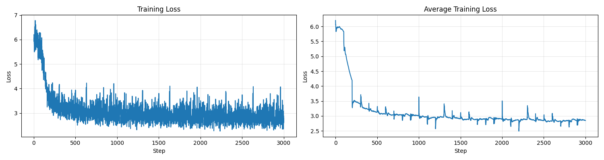

torch:

**ppl：**

jittor:

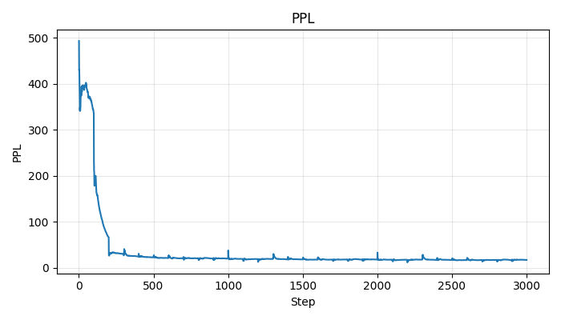

torch:

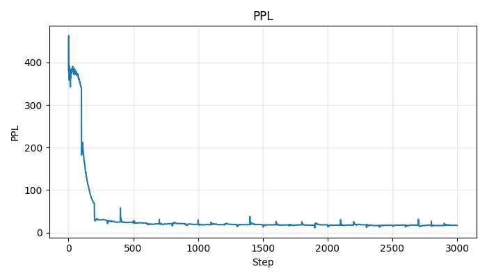

**评测指标：**

|             | **BLEU** | **NIST** | **METEOR** | **ROUGE_L** | **CIDEr** | Time(Evaluation) |
| :---------: | :------: | :------: | :--------: | :---------: | :-------: | :--------------: |
| **PyTorch** |  0.5497  |  6.8085  |   0.3990   |   0.6561    |  2.1865   |      83.75       |
| **Jittor**  |  0.5860  |  6.9723  |   0.4012   |   0.6642    |  2.2715   |      44.67       |


### 复现结果 -- WebNLG 数据集

##### **loss曲线：**

jittor：

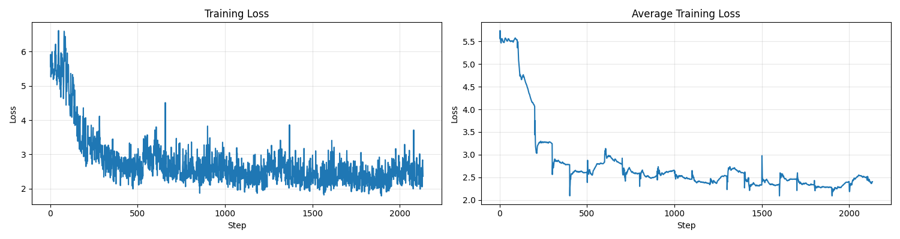

torch:

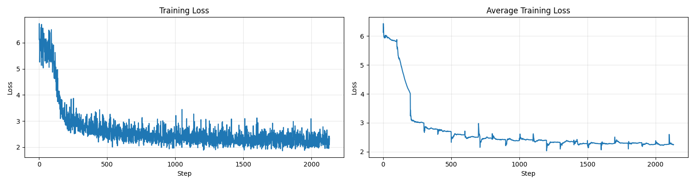

**ppl:**

jittor:

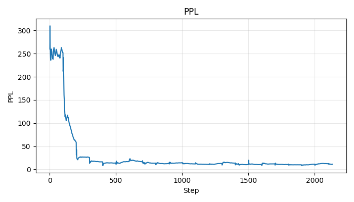

torch:

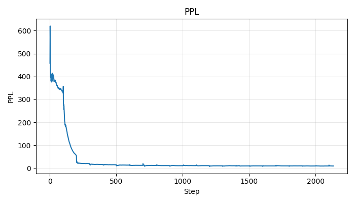

##### **评测指标：**

|             | BLEU  | BLEU NLTK | METEOR | TER  | Time(Evaluation) |
| :---------: | :---: | :-------: | :----: | :--: | :--------------: |
| **PyTorch** | 68.09 |   0.68    |  0.49  | 0.26 |       3.62       |
| **Jittor**  | 64.26 |   0.64    |  0.46  | 0.29 |       6.63       |


### 复现结果 -- DART 数据集

##### **loss曲线：**

jittor：

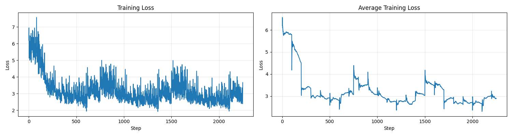

torch:

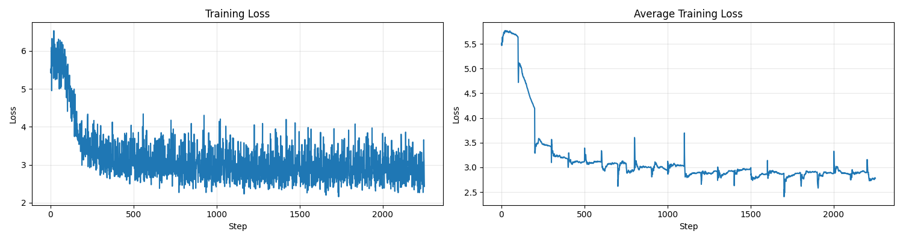

**ppl:**

jittor:

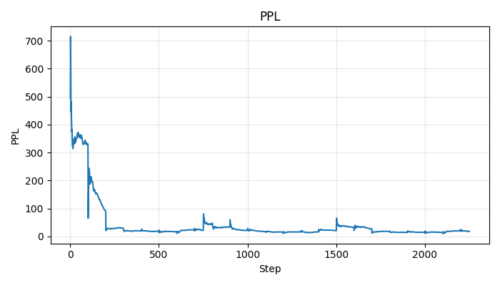

torch:

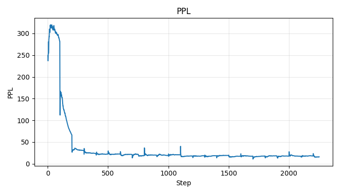

##### **评测指标：**

|             | BLEU  | BLEU NLTK | METEOR | TER  | Time(Evaluation) |
| :---------: | :---: | :-------: | :----: | :--: | :--------------: |
| **PyTorch** | 25.48 |   0.25    |  0.27  | 0.68 |       4.75       |
| **Jittor**  | 23.52 |   0.23    |  0.27  | 0.74 |       9.20       |


### 复现步骤-- E2E 数据集

1. ##### 使用 LoRA 训练 GPT-2 模型

   jittor:

   ```
   python  src/gpt2_ft.py \
   --log_dir ./log/e2e \
   --train_data ./data/e2e/train.jsonl \
   --valid_data ./data/e2e/valid.jsonl \
   --train_batch_size 4 \
   --grad_acc 1 \
   --valid_batch_size 1 \
   --seq_len 256 \
   --model_card gpt2.sm \
   --init_checkpoint ./pretrained_checkpoints/gpt2-pytorch_model.bin \
   --platform local \
   --clip 0.0 \
   --lr 0.0002 \
   --weight_decay 0.01 \
   --correct_bias \
   --adam_beta2 0.999 \
   --scheduler linear \
   --warmup_step 500 \
   --max_epoch 3 \
   --save_interval 1000 \
   --lora_dim 4 \
   --lora_alpha 32 \
   --lora_dropout 0.1 \
   --label_smooth 0.1 \
   --work_dir ./trained_models/GPT2_SM/e2e \
   --random_seed 100
   ```

   pytorch:

   ```
   python -m torch.distributed.launch --nproc_per_node=1 src/gpt2_ft.py \
   --log_dir ./log/e2e \
   --train_data ./data/e2e/train.jsonl \
   --valid_data ./data/e2e/valid.jsonl \
   --train_batch_size 4 \
   --grad_acc 1 \
   --valid_batch_size 1 \
   --seq_len 256 \
   --model_card gpt2.sm \
   --init_checkpoint ./pretrained_checkpoints/gpt2-pytorch_model.bin \
   --platform local \
   --clip 0.0 \
   --lr 0.0002 \
   --weight_decay 0.01 \
   --correct_bias \
   --adam_beta2 0.999 \
   --scheduler linear \
   --warmup_step 500 \
   --max_epoch 3 \
   --save_interval 1000 \
   --lora_dim 4 \
   --lora_alpha 32 \
   --lora_dropout 0.1 \
   --label_smooth 0.1 \
   --work_dir ./trained_models/GPT2_SM/e2e \
   --random_seed 100
   ```

2. ##### 使用beam search生成输出

   jittor:

   ```
   python src/gpt2_beam.py \
       --data ./data/e2e/test.jsonl \
       --log_dir ./log/e2e \
       --batch_size 1 \
       --seq_len 256 \
       --eval_len 64 \
       --model_card gpt2.sm \
       --init_checkpoint ./trained_models/GPT2_SM/e2e/model.3324.pt \
       --platform local \
       --lora_dim 4 \
       --lora_alpha 32 \
       --beam 10 \
       --length_penalty 0.8 \
       --no_repeat_ngram_size 4 \
       --repetition_penalty 1.0 \
       --eos_token_id 628 \
       --work_dir ./trained_models/GPT2_SM/e2e \
       --output_file predict.3324.b10p08r4.jsonl
   ```

   pytorch:

   ```
   python -m torch.distributed.launch --nproc_per_node=1 src/gpt2_beam.py \
   --log_dir ./log/e2e \
   --data ./data/e2e/test.jsonl \
   --batch_size 1 \
   --seq_len 256 \
   --eval_len 64 \
   --model_card gpt2.sm \
   --init_checkpoint ./trained_models/GPT2_SM/e2e/model.3000.pt \
   --platform local \
   --lora_dim 4 \
   --lora_alpha 32 \
   --beam 10 \
   --length_penalty 0.8 \
   --no_repeat_ngram_size 4 \
   --repetition_penalty 1.0 \
   --eos_token_id 628 \
   --work_dir ./trained_models/GPT2_SM/e2e \
   --output_file predict.3000.b10p08r4.jsonl
   ```

   

3. ##### 解码生成的输出

   ```
   python src/gpt2_decode.py \
   --log_dir ./log/e2e \
   --vocab ./vocab \
   --sample_file ./trained_models/GPT2_SM/e2e/predict.3000.b10p08r4.jsonl \
   --input_file ./data/e2e/test_formatted.jsonl \
   --output_ref_file e2e_ref.txt \
   --output_pred_file e2e_pred.txt
   ```

4. ##### 在 E2E 测试集上运行评估

   ```
   python eval/e2e/measure_scores.py e2e_ref.txt e2e_pred.txt -p
   ```
   
   

### 复现步骤 -- WebNLG 数据集

**具体脚本参数：**

1. **按照 E2E 流程的步骤 1 和步骤 2（替换为 WebNLG 数据集）**

   jittor:

   ```
   python  src/gpt2_ft.py \
       --log_dir ./log/webnlg_challenge_2017 \
       --train_data ./data/webnlg_challenge_2017/train.jsonl \
       --valid_data ./data/webnlg_challenge_2017/valid.jsonl \
       --train_batch_size 4 \
       --grad_acc 1 \
       --valid_batch_size 1 \
       --seq_len 256 \
       --model_card gpt2.sm \
       --init_checkpoint ./pretrained_checkpoints/gpt2-pytorch_model.bin \
       --platform local \
       --clip 0.0 \
       --lr 0.0002 \
       --weight_decay 0.01 \
       --correct_bias \
       --adam_beta2 0.999 \
       --scheduler linear \
       --warmup_step 500 \
       --max_epoch 3 \
       --save_interval 1000 \
       --lora_dim 4 \
       --lora_alpha 32 \
       --lora_dropout 0.1 \
       --label_smooth 0.1 \
       --work_dir ./trained_models/GPT2_SM/webnlg_challenge_2017 \
       --random_seed 100
   ```

   ```
   python src/gpt2_beam.py \
       --data ./data/webnlg_challenge_2017/test.jsonl \
       --log_dir ./log/webnlg_challenge_2017 \
       --batch_size 1 \
       --seq_len 256 \
       --eval_len 64 \
       --model_card gpt2.sm \
       --init_checkpoint ./trained_models/GPT2_SM/webnlg_challenge_2017/model.615.pt \
       --platform local \
       --lora_dim 4 \
       --lora_alpha 32 \
       --beam 10 \
       --length_penalty 0.8 \
       --no_repeat_ngram_size 4 \
       --repetition_penalty 1.0 \
       --eos_token_id 628 \
       --work_dir ./trained_models/GPT2_SM/webnlg_challenge_2017 \
       --output_file predict.615.b10p08.jsonl
   ```

   pytorch:

   ```
   python   -m torch.distributed.launch --nproc_per_node=1 src/gpt2_ft.py \
       --log_dir ./log/webnlg_challenge_2017 \
       --train_data ./data/webnlg_challenge_2017/train.jsonl \
       --valid_data ./data/webnlg_challenge_2017/valid.jsonl \
       --train_batch_size 4 \
       --grad_acc 1 \
       --valid_batch_size 1 \
       --seq_len 256 \
       --model_card gpt2.sm \
       --init_checkpoint ./pretrained_checkpoints/gpt2-pytorch_model.bin \
       --platform local \
       --clip 0.0 \
       --lr 0.0002 \
       --weight_decay 0.01 \
       --correct_bias \
       --adam_beta2 0.999 \
       --scheduler linear \
       --warmup_step 500 \
       --max_epoch 3 \
       --save_interval 1000 \
       --lora_dim 4 \
       --lora_alpha 32 \
       --lora_dropout 0.1 \
       --label_smooth 0.1 \
       --work_dir ./trained_models/GPT2_SM/webnlg_challenge_2017 \
       --random_seed 100
   ```

   ```
   python -m torch.distributed.launch --nproc_per_node=1 src/gpt2_beam.py \
       --data ./data/webnlg_challenge_2017/test.jsonl \
       --log_dir ./log/webnlg_challenge_2017 \
       --batch_size 1 \
       --seq_len 256 \
       --eval_len 64 \
       --model_card gpt2.sm \
       --init_checkpoint ./trained_models/GPT2_SM/webnlg_challenge_2017/model.615.pt \
       --platform local \
       --lora_dim 4 \
       --lora_alpha 32 \
       --beam 10 \
       --length_penalty 0.8 \
       --no_repeat_ngram_size 4 \
       --repetition_penalty 1.0 \
       --eos_token_id 628 \
       --work_dir ./trained_models/GPT2_SM/webnlg_challenge_2017 \
       --output_file predict.615.b10p08.jsonl
   ```

   

2. ##### **解码beam search生成的输出**

   ```
   python src/gpt2_decode.py \
       --log_dir ./log/webnlg_challenge_2017 \
       --vocab ./vocab \
       --sample_file ./trained_models/GPT2_SM/webnlg_challenge_2017/predict.615.b10p08.jsonl \
       --input_file ./data/webnlg_challenge_2017/test_formatted.jsonl \
       --ref_type webnlg \
       --ref_num 6 \
       --output_ref_file eval/GenerationEval/data/references_webnlg \
       --output_pred_file eval/GenerationEval/data/hypothesis_webnlg \
       --tokenize --lower
   ```

3. ##### 在 WebNLG 测试集上运行评估

   ```
   cd ./eval/GenerationEval/
   python eval.py \
       -R data/references_webnlg/reference \
       -H data/hypothesis_webnlg \
       -nr 6 \
       -m bleu,meteor,ter 
   cd ../..
   ```

   

### 复现步骤 -- DART 数据集

1. **按照 E2E 流程的步骤 1 和步骤 2（替换为 DART 数据集）**

   jittor:

   ```
   python  src/gpt2_ft.py \
       --log_dir ./log/dart \
       --train_data ./data/dart/train.jsonl \
       --valid_data ./data/dart/valid.jsonl \
       --train_batch_size 4 \
       --grad_acc 1 \
       --valid_batch_size 1 \
       --seq_len 256 \
       --model_card gpt2.sm \
       --init_checkpoint ./pretrained_checkpoints/gpt2-pytorch_model.bin \
       --platform local \
       --clip 0.0 \
       --lr 0.0002 \
       --weight_decay 0.01 \
       --correct_bias \
       --adam_beta2 0.999 \
       --scheduler linear \
       --warmup_step 500 \
       --max_epoch 5 \
       --save_interval 1000 \
       --lora_dim 4 \
       --lora_alpha 32 \
       --lora_dropout 0.1 \
       --label_smooth 0.1 \
       --work_dir ./trained_models/GPT2_SM/dart \
       --random_seed 100
   ```

   ```
   python src/gpt2_beam.py \
       --data ./data/dart/test.jsonl \
       --log_dir ./log/dart \
       --batch_size 1 \
       --seq_len 256 \
       --eval_len 64 \
       --model_card gpt2.sm \
       --init_checkpoint ./trained_models/GPT2_SM/dart/model.785.pt \
       --platform local \
       --lora_dim 4 \
       --lora_alpha 32 \
       --beam 10 \
       --length_penalty 0.8 \
       --no_repeat_ngram_size 4 \
       --repetition_penalty 1.0 \
       --eos_token_id 628 \
       --work_dir ./trained_models/GPT2_SM/dart \
       --output_file predict.785.b10p08.jsonl
   ```

   pytorch:

   ```
   python -m torch.distributed.launch --nproc_per_node=1 src/gpt2_ft.py \
       --log_dir ./log/dart \
       --train_data ./data/dart/train.jsonl \
       --valid_data ./data/dart/valid.jsonl \
       --train_batch_size 4 \
       --grad_acc 1 \
       --valid_batch_size 1 \
       --seq_len 256 \
       --model_card gpt2.sm \
       --init_checkpoint ./pretrained_checkpoints/gpt2-pytorch_model.bin \
       --platform local \
       --clip 0.0 \
       --lr 0.0002 \
       --weight_decay 0.01 \
       --correct_bias \
       --adam_beta2 0.999 \
       --scheduler linear \
       --warmup_step 500 \
       --max_epoch 5 \
       --save_interval 1000 \
       --lora_dim 4 \
       --lora_alpha 32 \
       --lora_dropout 0.1 \
       --label_smooth 0.1 \
       --work_dir ./trained_models/GPT2_SM/dart \
       --random_seed 100 
   ```

   ```
   python -m torch.distributed.launch --nproc_per_node=1 src/gpt2_beam.py \
       --data ./data/dart/test.jsonl \
       --log_dir ./log/dart \
       --batch_size 1 \
       --seq_len 256 \
       --eval_len 64 \
       --model_card gpt2.sm \
       --init_checkpoint ./trained_models/GPT2_SM/dart/model.785.pt \  
       --platform local \
       --lora_dim 4 \
       --lora_alpha 32 \
       --beam 10 \
       --length_penalty 0.8 \
       --no_repeat_ngram_size 4 \
       --repetition_penalty 1.0 \
       --eos_token_id 628 \
       --work_dir ./trained_models/GPT2_SM/dart \
       --output_file predict.785.b10p08.jsonl 
   ```

   

2. **使用beam search生成输出**

   ```
   python src/gpt2_decode.py \
       --log_dir ./log/dart \
       --vocab ./vocab \
       --sample_file ./trained_models/GPT2_SM/dart/predict.785.b10p08.jsonl \
       --input_file ./data/dart/test_formatted.jsonl \
       --ref_type dart \
       --ref_num 6 \
       --output_ref_file eval/GenerationEval/data/references_dart \
       --output_pred_file eval/GenerationEval/data/hypothesis_dart \
       --tokenize --lower
   ```

3. **在 DART 测试集上运行评估**

   ```
   cd ./eval/GenerationEval/
   python eval.py \
       -R data/references_dart/reference \
       -H data/hypothesis_dart \
       -nr 6 \
       -m bleu,meteor,ter 
   cd ../..
   ```

   

## 调试经验

##### 1、评测时报错： cannot import name 'OrderedDict' from 'typing' ，原因 python3.7 的typing不支持OrderedDict

**解决办法1**：安装typing_extensions库 (pip install typing_extensions)，并修改

python3.7/site-packages/tensorflow/core/function/polymorphism/function_type.py文件（该文件从报错信息处找到）

```
# from typing import Any, Callable, Dict, Mapping, Optional, Sequence, Tuple, OrderedDict
# 改为

from typing import Any, Callable, Dict, Mapping, Optional, Sequence, Tuple
from typing_extensions import OrderedDict
```

解决办法2：安装python>=3.8的环境，并安装 eval 评估的环境

```
# 1、安装python3.9
conda create -n eval python=3.9
conda activate eval

# 2、安装 eval 评估的环境
# 项目NLG目录下
cd ./eval
bash download_evalscript.sh
cd ..

# 3、运行评估代码(第4步)
# e2e
python eval/e2e/measure_scores.py e2e_ref.txt e2e_pred.txt -p


# webnlp
cd ./eval/GenerationEval/
python eval.py \
    -R data/references_webnlg/reference \
    -H data/hypothesis_webnlg \
    -nr 6 \
    -m bleu,meteor,ter 
cd ../..

# dark
cd ./eval/GenerationEval/
python eval.py \
    -R data/references_dart/reference \
    -H data/hypothesis_dart \
    -nr 6 \
    -m bleu,meteor,ter 
cd ../..
```

##### 2、Resource punkt not found.

解决办法，在 NLG/eval/GenerationEval/eval.py  加入下面的代码

```
# NLG/eval/GenerationEval/eval.py 中修改
import nltk
nltk.download('punkt')
```

##### 3、 计算METEOR时 Broken pipe

原因：路径中有中文，meteor-1.5.jar包运行**路径不可存在中文**，否则无法运行！

##### 4、导入Jittor 报错 GLIBCXX_3.4.30‘ not found 解决

```
#查找libstdc++.so.6的位置
sudo find / -name libstdc++.so.6
```

```
#进行链接 lora_gpt 改为环境名
cd ~/anaconda3/envs/lora_gpt/lib
rm libstdc++.so
rm libstdc++.so.6
ln -s /usr/lib/x86_64-linux-gnu/libstdc++.so.6.0.30 libstdc++.so
ln -s /usr/lib/x86_64-linux-gnu/libstdc++.so.6.0.30 libstdc++.so.6
```

##### 5、jittor 出现爆显存错误：

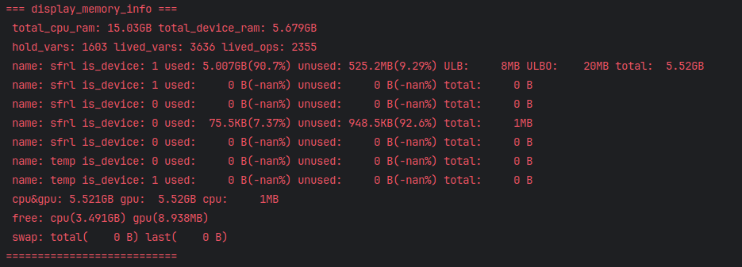

使用下面代码查看 模型执行过程中的显存占用分布树：

```
# with jt.flag_scope(trace_py_var=3, profile_memory_enable=1):
#     _lm_logits, _lm_loss = model(
#         _input, lm_labels=_target, lm_mask=_msk, label_smooth=args.label_smooth
#     )
#     jt.get_max_memory_treemap()
```

总共可用的显存大小为5.52GB，而模型参数占据了4.5GB显存

因此本次实验使用sm版本的gpt2模型

